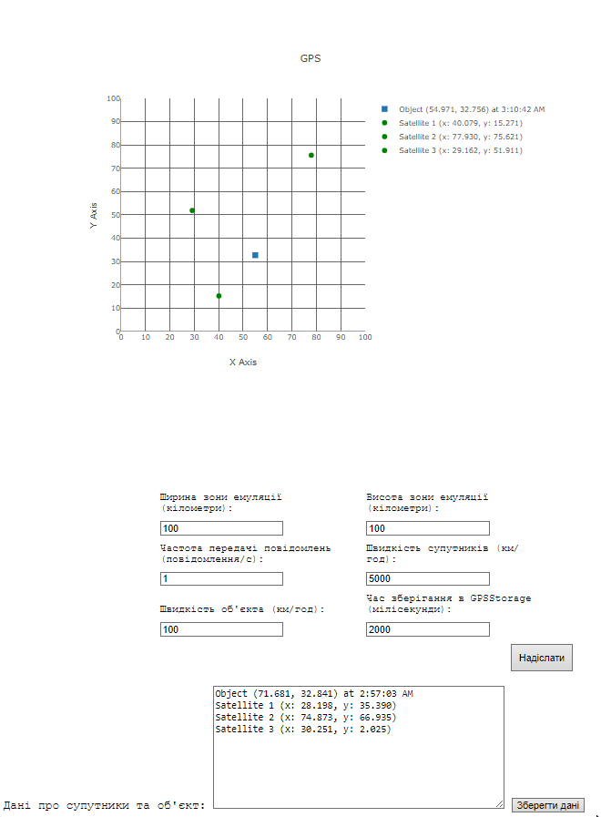

## Розробка додатку для візуалізації вимірювань GPS. Колєснік Євгеній ІПЗ-4.01

## Мета

Розробити додаток, який зчитує дані з емульованої вимірювальної частини GPS, наданої у вигляді Docker image, та відображає положення об'єкта і супутників на графіку в декартових координатах.

## Завдання

Згідно до поставленого завдання необхідно було створити веб-додаток, що в реальному часі відображає дані про задетектовані цілі на графіку та дозволяє змінювати параметри GPS.

1. Розробити додаток для відображення положення об'єкта та супутників:
    - Розробити веб-додаток, який підключається до WebSocket сервера та зчитує дані про положення супутників і об'єкта;
    - Відобразити отримані дані на графіку в декартових координатах. Для цього можна використати бібліотеку Plotly або іншу бібліотеку для роботи з графіками.
2. Обробка та візуалізація даних:
    - Обробити дані, отримані через WebSocket, і відобразити положення об'єкта та супутників на графіку;
    - Додати можливість зміни параметрів вимірювальної частини GPS за допомогою API запитів.
3. Налаштування графіка:
    - Відобразити координати супутників та об'єкта у декартових координатах;
    - Використати різні кольори або стилі точок для відображення супутників та об'єкта.

## Конфігурація середи

Емулятор GPS надається у вигляді Docker зображення під назвою `gps-emulation-service`.

Завантажимо зображення з Docker Hub:

> docker pull iperekrestov/university:gps-emulation-service

Запустимо контейнер з ім'ям `gps-e` на порту `4001` для з'єднання з емульованою вимірювальною частиною gps:

```bash
docker run --name gps-e -p 4001:4000 iperekrestov/university:gps-emulation-service
```

## API

Сервіс підтримує API для зміни наступних параметрів GPS:

**emulationZoneSize** - розмір зони емуляції; 
**messageFrequency** - частота передачі повідомлень супутниками; 
**objectSpeed** - швидкість руху об'єкта; 
**satelliteSpeed** - швидкість руху супутників.

За замовчуванням застосовані наступні параметри:

**emulationZoneSize** - 200x200 км; 
**messageFrequency** - кількість повідомлень у секунду, за замовчуванням 1; 
**objectSpeed** - 10 км/год; 
**satelliteSpeed** - 100 км/год.

Дані надсилаються через WebSocket містять інформацію про задетектовані цілі та передаються у форматі JSON:

```bash
{
  "id": "uuid", // Унікальний ідентифікатор супутника (UUID)
  "x": 100.5,  // Координати супутника по осі X (у кілометрах)
  "y": 200.3, // Координати супутника по осі Y (у кілометрах)
  "sentAt": 1692170400000,  // Час відправки повідомлення супутником (мілісекунди з початку епохи Unix)
  "receivedAt": 1692170400100 // Час отримання повідомлення об'єктом (мілісекунди з початку епохи Unix)
}

```

## Технології

Для створення додатку візуалізації GPS обрано JavaScript, HTML і CSS, які забезпечують інтерактивність та стиль інтерфейсу. JavaScript відповідає за динамічне оновлення даних, HTML — за структуру, а CSS — за стилізацію. Для графіків використано Plotly, що дозволяє створювати розширені візуалізації. Серверна частина налаштована на Express з middleware для проксі, що спрощує обробку запитів і маршрутизацію. Використання Node.js забезпечує середовище виконання серверного коду, а управління залежностями здійснюється через npm.

## CORS

Щоб браузер міг надсилати запити (наприклад, POST, PUT) до конфігураційного сервера Docker радара (http://localhost:4001/config), веб-сервер повинен дозволяти ці запити з інших доменів.

Виявлено, що сервер не відповідав на OPTIONS запити. Для вирішення цього налаштовано проксі-сервер на порту 3000, що перенаправляє запити на http://localhost:4001 з використанням express і http-proxy-middleware.

Конфігурація включає:

- Проксі для API з обробкою заголовків CORS;
- Обробку статичних файлів з директорії public;
- Відповідь на запити до кореневого маршруту, надаючи HTML-файл.
- Налаштування сервера виконано у файлі proxy.js

Запуск проєкта виконується так:

> node proxy.js

## Приймання повідомлень GPS

Для приймання повідомлень від GPS було створено клас `GPSService`, файл `public/src/GPSService.js`. Він відповідальний за отримання `fetchConfiguration` та оновлення конфігурації `updateConfiguration`, а також за підключення до веб-сокета емудятора GPS `connectWebSocket`. Його конструктор приймає адресу для конфігурації, адресу сокета та назву події, яку генерує сервіс для кожного повідомлення сокета.

## Зберігання данних супутників

Для зберігання данних супутників використовується клас `GPSStorage`, файл `public/src/GPSStorage.js`.

Він використовується для визначення часу збрігання даних від супутників, розраховує можливе положення цілі та підготовлює данні для зручної обробки прии будуванні графу GPS.

## Будування графіку GPS

Для малювання графіку GPS, було створено клас `GPSGraph`, файл `public/src/GPSGraph.js`. Він використовує бібліотеку Plotly для візуалізації. Елементи на графіку будуються відповідно до отриманих значень зі сховища даних. Дані супутників та цілі вказуються у легенді разом з часом визначення.

## Конфігурація

Для відображення та зміни значень конфігурації GPS, було створено клас `GPSConfig`, файл `public/src/GPSConfig.js`. Він відповідає за оновлення конфігурації GPS та встановлення нової конфігурації до форми. У конструкторі він приймає калбек, якому передається зчитана з форми конфігурація GPS.

## Головний асинхроний скрипт

Головний скрипт відповідає за ініціалізацію та управління GPS-системою. Спочатку він імпортує необхідні класи: `GPSService`, `GPSGraph`, `GPSConfig` та `GPSStorage`. Далі створюються об'єкти цих класів, налаштовуючи параметри для підключення до API конфігурації та веб-сокетів.

У функції main() виконується отримання конфігурації GPS-сервісу, а також підключення до веб-сокету для отримання даних. Визначається форма для налаштувань, і при її зміні оновлюються конфігурації GPS-сервісу, графіку та сховища.

Головний скрипт також слухає події, пов'язані з отриманням GPS-даних, і додає їх у сховище. При завантаженні документа викликається функція main(), яка запускає всю логіку програми. Додатково реалізовано обробник кнопки для збереження даних про супутники та об'єкт у текстове поле.

## Перевірка

Запустимо проєкт, перевіримо працю GPS, оновлення конфігурації та збереження даних:

Результат:



GPS успішно в реальному часі відображає дані веб-сокету, дозволяє змінювати конфігурацію та зберігати дані цілей за потрібності.

## Висновок

Виконуючи цю роботу я  підтвердив теоретичний матеріал з теми розробки додатку для візуалізації вимірювань GPS. Під час виконання роботи я розробив додаток, який зчитує дані з емульованої вимірювальної частини GPS, наданої у вигляді Docker image, та відображає положення об'єкта і супутників на графіку в декартових координатах. Отриманні знання є основою при розробці систем пов'язаних з роботою з координатами.